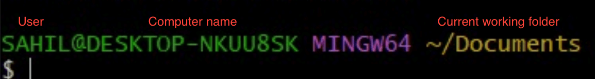
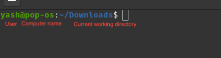

# Command Line Essentials
Learn the basic commands to use your computer via command line by this document.

Command line is a way to interact with your computer using text commands instead of graphical interfaces (like clicking icons with a mouse). 

Using command line can seem intimidating at first, but it's a valuable skill that can make your interaction with computers more efficient and powerful.

## Prerequisites
For following the examples in this document, open "Git Bash" in Windows (Installed by default with Git). Or open "Terminal" if on MacOS or Linux.

## Understanding the prompt
When you open the command line, you'll see a window with some text. This is your command prompt. It often displays your username, computer name, and the current directory (folder) you're in. It looks similar to this.

On Windows (Git Bash):



<br>
On Mac/Linux:



## Navigation
Here are some common commands to navigate around the filesystem.

Command | Usage
--------|-------
```cd <PATH>```    | Changes the current working directory to given ```<PATH>```<br> eg. ```cd Downloads``` or ```cd Documents/MyFolder``` <br> When ```<PATH>``` isn't provided, cd navigates to the home directory of your computer.
```ls``` | Shows files in the current working directory
```ls -l``` | Same as ```ls``` but shows in list view
```ls -a``` | Same as ```ls``` but also shows hidden files
```ls -al``` | Combination of the above two <br> Here, ```-a``` & ```-l``` are known as the flags for the command
```ls -a -l``` | Same as ```ls -al```
```mkdir <FOLDERNAME>``` | Creates a new folder with the given name in the current working directory. <br> eg. ```mkdir Projects```
```touch <FILENAME>``` | Creates an empty file with the given name in the current working directory. <br> eg. ```touch myfile.txt``` or ```touch app.py```
```rm <FILENAME>``` | Deletes the file with the given name from the current working directory. <br>eg. ```rm app.py```
```rm -r``` | Deletes folder along with any nested files.
```rmdir``` | Deletes an empty folder.
```clear``` | Clears the terminal screen of previous output.

## Using Applications
Similar to GUI, some applications also provide ways to access them through Command Line. eg. ```Git``` and ```Visual Studio Code```

For using these applications, instead of clicking on an icon, you type its name in the terminal. And also sometimes provide parameters.

### Flags in applications
Some applications have some flags that provide useful information or invoke a specific functionality. Flags start with a single or double hyphen (eg. ```--version``` or ```-v```)

Previously, we used flags with the ```ls``` application to modify its results by using the ```-l``` & ```-a``` flags.

### Common command line application syntax

Opening VSCode in current folder

```code .```

Opening VSCode in specific ```<PATH>```

```code <PATH>```

> When directly executing ```code``` without any parameters, it opens the most recently used folder.

Knowing Git Version

```git --version```

> Found a mistake or have other improvement for this guide?  
Submit a Pull Request!
