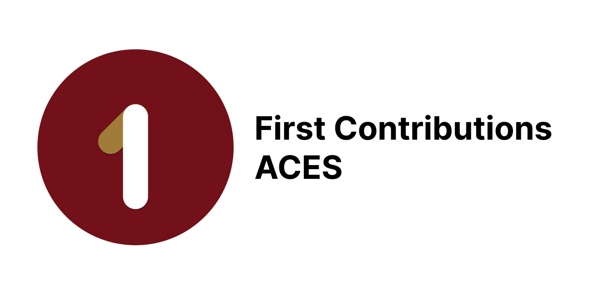
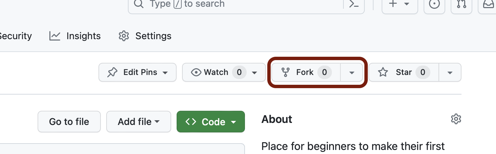
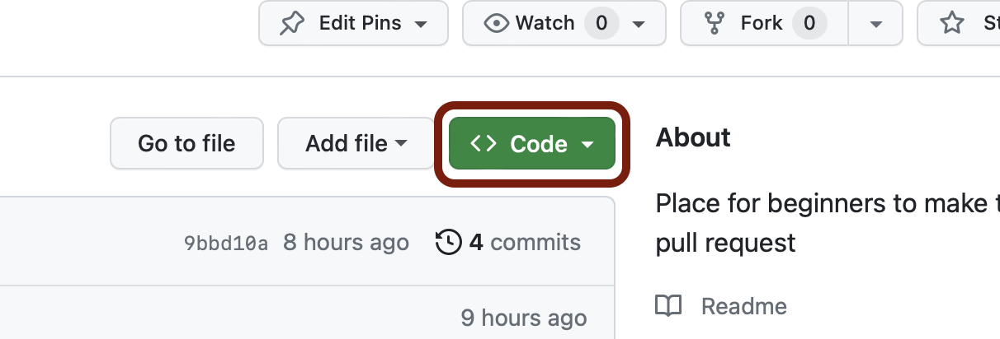

# First Contributions
Place for beginners to make their first pull request.

## Prerequisites
You must have git installed & set up on your computer.\
Download Git from [git-scm.com](https://git-scm.com/downloads/)

[Instructions for connecting your computer to your GitHub account](/Setup.md)

## Fork this repository
Fork this repository by clicking the fork button on the top of this page.\
This will create a copy of this repository in your account.



## Clone the repository
Now clone the forked repository to your computer. Go to your forked repository on GitHub website, click the code button and then click the _copy to clipboard_ icon.




#### Open a terminal and run the following git command:

`git clone <URLYOUCOPIED>`

## Create a branch

Change to the repository directory on your computer (if not already there)
```bash
cd first-contributions
```

Now, create a branch using `git branch` command
```bash
git branch branch_name
```
Switch to the newly created branch
```bash
git switch branch_name
```
## Make necessary changes
Now open `Contributors.md` file in a text editor & add your entry to it. Put it anywhere in between and save the file.

If you execute `git status`, you'll see there are changes.

Add those changes to the branch you just created using the `git add` command.
```bash
git add Contributors.md
```
Commit those changes using the `git commit` command
```bash
git commit -m "Add YOURNAME to Contributors list"
```

## Push changes to GitHub
Now if you go to your repository on GitHub, you'll see a `Compare & pull request` button. Click it.

Now submit the Pull Request.

Soon, your changes will be merged into the main branch of this repository. You'll get a notification email once your changes have been merged.

## Next
Congratulations 🎉!  
You just completed the standard _fork -> clone -> edit -> PR_ workflow that you'll use often.

<!-- TODO: Add reference to PBL project list -->

> Inspired by [first-contributions](https://github.com/firstcontributions/first-contributions/)

\
_A project by Association of Computer Engineering Students, DIT Pimpri_


